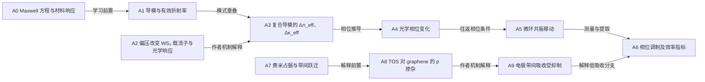

# 两条 First-Principles pilot path

日期：2026-10-05。版本：draft-v1。交付范围：两篇论文的可追溯学习路径草案。

所有节点和关系均为 **CANDIDATE**；已做原文定位和模型检查，人工科学评审为 PENDING。路径尚未写入应用数据库，也没有产生 VERIFIED、人工 accept 或 Gate B PASS。此前 Gate A 的人工评审条件保持原记录。

目标读者暂定为有本科电磁学、基础量子力学和半导体器件知识的研究生。这里的第一性原理指解释本任务所需的基础定律、定义及明确的近似。

## 来源与阅读方式

| 标签 | 含义 |
| --- | --- |
| PAPER_DERIVED | 来自所给 PDF；再区分测量数据、计算结果及作者机制解释。 |
| EXTERNAL_SCIENTIFIC_KNOWLEDGE | 来自明确列出的外部科学资料。 |
| AI_DERIVATION | 为教学所作的推导或关系解释；明确列出假设。 |

下文 A0、B0 等是本报告内的阅读定位符。证据编号 PA-*、PB-* 对应 [原文证据清单](FIRST-PRINCIPLES-PILOT-PATHS.sources.json)，其中保留源文件哈希、PDF 页码、文字块坐标和实际抽取文字。PDF 页码从 1 开始，取证快照的文字块索引从 0 开始；清单另列当前解析器的块编号。坐标精度为 TEXT_BLOCK，这些定位符均为报告内标识。

先从核心概念倒查直接前置知识，再按任务需要查到基础定义。以下图示给出正向阅读顺序；关系表分别说明学习依赖、数学推导、机制解释和测量，图中的每条连线都需要按表解释。

## Path A：有效折射率 → 电控相位 → 近低损耗调制

论文：[Guo 等，2026，Hybrid tungsten oxyselenide/graphene electrodes for near-lossless 2D semiconductor phase modulators](https://doi.org/10.1038/s41377-025-02058-8)。核心问题：为什么改变顶层二维材料的响应能够改变 SiN 微环的光学相位，同时限制电极引入的吸收？

### 节点与为什么需要它

| 节点 | 内容与作用 | 知识来源 / 认识状态 | 证据 |
| --- | --- | --- | --- |
| A0 | Maxwell 方程、材料响应及边界条件共同约束允许传播的电磁场。 | EXTERNAL_SCIENTIFIC_KNOWLEDGE / BACKGROUND_KNOWLEDGE | X1，§2.1、§2.7 |
| A1 | 导模有传播常数 β；有效折射率描述整个导模，而非单一材料。必须理解这一点才能把二维材料的变化连接到器件相位。 | EXTERNAL_SCIENTIFIC_KNOWLEDGE / BACKGROUND_KNOWLEDGE | X1，Eq.2.337 |
| A2 | 论文的 WS₂/hBN/graphene/TOS 电容结构中，偏压调节 WS₂ 载流子与光学响应。 | PAPER_DERIVED / AUTHOR_CLAIM | PA-structure、PA-gating |
| A3 | 顶层材料与 SiN 导模倏逝场重叠，改变复合系统的有效复折射率；作者从光谱提取 Δn_eff、Δκ_eff。 | PAPER_DERIVED / AUTHOR_CLAIM | PA-mode、PA-effective、PA-fig4 |
| A4 | 传播常数变化使给定有源长度内的累积相位改变。 | AI_DERIVATION | 下方推导；前提 A1、A3 |
| A5 | 微环满足往返相位闭合条件；改变传播相位会移动共振。 | AI_DERIVATION | 下方推导；论文测量见 PA-structure |
| A6 | 偏压依赖的共振光谱及由其得到的 VπL，构成论文的调制证据；消光比变化另作损耗相关观察。 | PAPER_DERIVED / OBSERVED_DATA（光谱）及 AUTHOR_CLAIM（提取与解释） | PA-structure、PA-efficiency、PA-er |
| A7 | 带间跃迁需要合适的占据态与空态；费米能级改变会使某些跃迁受阻。 | EXTERNAL_SCIENTIFIC_KNOWLEDGE / BACKGROUND_KNOWLEDGE | X2，Fig.2C 及相邻正文 |
| A8 | 作者提出 TOS 诱导 graphene 重度 p 掺杂，费米能级位移约 −0.5 eV；这是电极分支。 | PAPER_DERIVED / AUTHOR_CLAIM | PA-transfer、PA-blocking |
| A9 | 作者据此解释电信波段带间吸收抑制，并用模拟及透射比较支撑；适用范围依测量条件。 | PAPER_DERIVED / AUTHOR_CLAIM | PA-blocking、PA-electrode-test、PA-loss |

### 每条关系的语义与边界

状态列中“候选”统一表示 CANDIDATE，尚无人工科学验收。

| 源 → 目标 | relation | 为什么需要这条关系 | 来源 / 认识状态 | 状态 |
| --- | --- | --- | --- | --- |
| A0 → A1 | PREREQUISITE_OF | 波导横截面的场和边界条件决定导模与 β，解释 n_eff 的物理含义。 | X1 / BACKGROUND_KNOWLEDGE | 候选 |
| A1 → A3 | PREREQUISITE_OF | 先知道导模分布，才能判断顶层材料变化怎样进入复合模态参数。 | X1、PA-mode / AI_INTERPRETATION | 候选 |
| A2 → A3 | AFFECTS | 作者把偏压下 WS₂ 响应变化连接到复合导模的折射率变化；需模式重叠和材料模型。 | PA-gating、PA-effective / AUTHOR_CLAIM | 候选 |
| A4 → A3 | MATHEMATICALLY_DERIVES_FROM | 相位变化由 Δn_eff 沿传播方向的积分给出；该关系方向为“派生量 → 来源”。 | 教学推导 / AI_DERIVATION | 候选 |
| A5 → A4 | MATHEMATICALLY_DERIVES_FROM | 共振条件要求往返累积相位为整数个 2π；相位变化可使共振波长移动。 | 教学推导 / AI_DERIVATION | 候选 |
| A5 → A6 | EXPLAINS | 共振移动解释如何从光谱识别相位调制；具体 VπL 仍需实验拟合和几何参数。 | PA-structure、PA-efficiency / AI_INTERPRETATION | 候选 |
| A7 → A8 | PREREQUISITE_OF | 费米占据解释 p 掺杂为什么会改变 graphene 的允许光学跃迁。 | X2、PA-blocking / AI_INTERPRETATION | 候选 |
| A8 → A9 | EXPLAINS | 本文提出的掺杂使 2\|E_F\| 超过电信光子能量，抑制相应带间吸收。 | PA-blocking、PA-electrode-test / AUTHOR_CLAIM | 候选 |
| A9 → A6 | EXPLAINS | 该分支解释电极吸收为什么较小；相位调制来源仍按作者归于 WS₂ 响应。 | PA-loss、PA-er / AUTHOR_CLAIM | 候选 |

### 连接基础与论文的公式

**外部定义：** β = k₀ n_eff，k₀ = 2π/λ₀。见 [X1，Eq.2.337](https://www.ocw.mit.edu/courses/6-974-fundamentals-of-photonics-quantum-electronics-spring-2006/8e54d1625e9e71eb5b4e4998e6967e4e_chapter2.pdf)。

**AI 教学推导：** 取场约定 E ∝ exp(iβz − iωt)，复有效折射率为 n′_eff + iκ_eff。于是实部决定相位，强度吸收系数 α = 2k₀κ_eff。在单一导模、固定真空波长且有源段近似均匀时：

\[
\Delta\phi=\frac{2\pi}{\lambda_0}\int_{\mathrm{active}}\Delta n'_{\mathrm{eff}}(s)\,ds
\approx\frac{2\pi}{\lambda_0}\Delta n'_{\mathrm{eff}}L_{\mathrm{active}}.
\]

在忽略额外耦合相位变化的简化微环模型中，∮Re(β)ds = 2πm。偏压改变该积分，共振就需要在新的波长上满足相位闭合。这是教学模型，尚未复现本文补充材料中的拟合过程；局部覆盖长度、群折射率、耦合和损耗都影响实际提取。

**本文数字与结论：** PA-efficiency 报告 TOS/graphene 器件 VπL = **0.202 V·cm**；PA-er 报告全测试偏压范围内消光比变化 **0.08 dB**。后者是消光比的变化量，不能改写成总插入损耗 0.08 dB。PA-fig4 明确区分复合模态 Δn_eff 与经模型转换得到的 WS₂ 本征 Δn。VπL 的实际计算引用补充材料 VI；当前提供的 A 主文 PDF 未包含该部分。

**低吸收分支：** PA-blocking 采用 2|E_F| ≈ 1.0 eV > 0.8 eV（1550 nm）解释 Pauli blocking。外部资料 [X2](https://www.ocf.berkeley.edu/~jode/pdf/347.Science.320-Wang.pdf)支撑费米占据改变带间跃迁的基础关系；TOS 的具体掺杂强度和器件结果由本文提供。带间吸收被抑制不等于所有频段、所有损耗机制均消失。

### 停止规则与学习检验

在 Maxwell 方程、基本材料响应以及费米占据处停止向下拆解：它们是本目标读者的基础知识。本次任务需要解释模态、相位及电极吸收；继续追到电磁学或量子力学的公理化起源不会补足本文具体器件证据。对 WS₂ 的微观电光响应只定位到作者所给模型与数据；所缺补充材料不以通用公式补成“已复现”。

读完应能回答：为什么 WS₂ 的材料折射率与导模 n_eff 不同？哪条分支控制相位、哪条分支抑制电极吸收？测得的光谱怎样支持 0.202 V·cm 和 0.08 dB 各自代表的指标？这些问题的用户学习效果尚未测评。

## Path B：量子输运基准 → 界面杂化 → 低接触电阻

论文：[Li 等，2023，Approaching the quantum limit in two-dimensional semiconductor contacts](https://doi.org/10.1038/s41586-022-05431-4)。核心问题：有限导电模式给出了什么基准，Sb/MoS₂ 界面怎样改善注入，实验又实际测到了什么？

### 节点与为什么需要它

| 节点 | 内容与作用 | 知识来源 / 认识状态 | 证据 |
| --- | --- | --- | --- |
| B0 | 电流由可用传播模式、态占据及模式透射决定；模式数量有限，即使理想透射也有有限双端电导。 | EXTERNAL_SCIENTIFIC_KNOWLEDGE / BACKGROUND_KNOWLEDGE | X3，§III–IV；X4，Eq.4–5 |
| B1 | 本文 Eq.1 给出作者采用的宽度归一化量子电阻基准，并明确假定弹道模式。 | PAPER_DERIVED / PAPER_EXPLICIT | PB-limit |
| B2 | 能级对齐、隧穿势垒以及波函数连接都会约束注入；低势垒并不独自保证单位透射。 | PAPER_DERIVED / AUTHOR_CLAIM | PB-barriers |
| B3 | Sb(01̅12) 与 (0001) 接触的 DFT 态和轨道分布不同；原 PDF 的第三个晶面指标带上划线。 | PAPER_DERIVED / AUTHOR_CLAIM（计算解释） | PB-fig1、PB-hybridization；结构表征 PB-fig2 |
| B4 | 作者提出跨界面轨道杂化、电荷转移及势垒共同改善注入；计算中接触下 MoS₂ CBM 约低于 E_F 0.4 eV。 | PAPER_DERIVED / AUTHOR_CLAIM | PB-hybridization、PB-vdw、PB-tunnel |
| B5 | TLM 从不同沟道长度的电阻拟合提取接触电阻；作者报告最低值、统计均值和相对量子基准的比较。 | PAPER_DERIVED / OBSERVED_DATA（电测量）及 AUTHOR_CLAIM（提取/比较） | PB-tlm、PB-statistics、PB-benchmark、PB-delay |
| B6 | 约 20 nm 器件的电流及内禀延迟指标说明器件收益；接触改善是作者解释中的一部分。 | PAPER_DERIVED / OBSERVED_DATA（电流）及 AUTHOR_CLAIM（延迟估算/解释） | PB-short-channel、PB-current、PB-delay |

晶面公式写法为 \(\mathrm{Sb}(0\,1\,\overline{1}\,2)\)。文字提取会丢失上划线，因此这里依据原 PDF 的视觉核对，不把抽取文本中的“0112”当作完整晶面符号。

### 每条关系的语义与边界

| 源 → 目标 | relation | 为什么需要这条关系 | 来源 / 认识状态 | 状态 |
| --- | --- | --- | --- | --- |
| B0 → B1 | PREREQUISITE_OF | 理解有限模式与理想透射，才能解释为什么“无散射”仍有量子电阻基准。 | X3、X4、PB-limit / AI_INTERPRETATION | 候选 |
| B0 → B2 | PREREQUISITE_OF | 透射连接界面电子结构与注入能力，避免只按材料名称判断接触好坏。 | X3、PB-barriers / AI_INTERPRETATION | 候选 |
| B2 → B3 | PREREQUISITE_OF | 先区分对齐、势垒与耦合，才能解释 DFT 中不同晶面的轨道差异。 | PB-barriers、PB-hybridization / AI_INTERPRETATION | 候选 |
| B3 → B4 | EXPLAINS | 作者将跨界面杂化和电荷转移用于解释简并接触区与较有利注入。 | PB-hybridization、PB-vdw、PB-tunnel / AUTHOR_CLAIM | 候选 |
| B4 → B5 | EXPLAINS | 注入改善是作者对低 R_c 的机制解释；DFT 与 TLM 提供不同层级的证据。 | PB-hybridization、PB-tlm、PB-statistics / AUTHOR_CLAIM | 候选 |
| B1 → B5 | COMPARES_WITH | 理论基准用于判断提取电阻离理想值多远；它本身不会导致实际 R_c 下降。 | PB-benchmark；X4 提醒比较约定 / AUTHOR_CLAIM | 候选 |
| B5 → B6 | EXPLAINS | 在同类器件条件下较小接触压降可改善导通电流；沟道、电热与栅电容仍会影响性能。 | PB-current、PB-delay / AUTHOR_CLAIM | 候选 |

### 连接基础与论文的公式

**外部输运基础及 AI 教学表达：** 在低温、线性响应、弹性输运及双端电压约定下，具有相同自旋简并的模式可写作 G = (2q²/h)ΣₘTₘ。这里 Tₘ 为透射本征值，求和不重复计入自旋。该表达由 [X3](https://journals.aps.org/prb/abstract/10.1103/PhysRevB.31.6207)的多通道电流关系结合储库电压定义得到；X3 同时讨论局部电压定义，不能混用。理想 Tₘ = 1 时，有限模式数仍限制双端电导。

**本文 Eq.1 的视觉转写（PB-limit）：**

\[
R_{c,\min}=\frac{h}{2q^2}\sqrt{\frac{\pi}{2n_{2D}}}.
\]

该式的单位是 Ω·长度，与论文中的 Ω·μm 相符。这里保留作者的 R_c 记号和公式。将 n₂D 化为传播模式数需要能带、温度及简并约定；跨论文比较还必须区分单接触 R_c、两个接触 2R_c 和双端弹道电阻。

**外部约定检查：** [X4（2025）](https://www.nature.com/articles/s41928-024-01335-5)讨论谷简并引入的前因子，并主张将两个接触的 2R_c 与双端弹道电阻比较。这是后续文献的分析，与 Li 等本文作者的 Eq.1 及“高密度下在量子极限两倍以内”的比较结论分开记录。当前草案没有统一这些约定后的重新估值，也不把原论文的比较升级为已核实的绝对“达到极限”。

**AI 教学推导：** 在对称接触、近线性电测量的简化 TLM 模型下，令 r_c 为宽度归一化接触电阻，则 R_tot W ≈ 2r_c + R_sheet L。纵截距对应 2r_c。PB-tlm 明确指出，提取转移长度 L_T 假定接触下与接触外片电阻相同，而电荷转移可能使该假定不成立，增加 L_T 的不确定性。

**本文数字与边界：**

- 最低接触电阻 **42 Ω·μm**；优选晶面接触的统计均值 **209 ± 100 Ω·μm**。两个数字承担不同角色，见 PB-delay、PB-statistics。
- 约 20 nm 器件在 V_ds = 1 V 的直流导通电流 **1.23 mA/μm**，见 PB-short-channel、PB-current。
- **74 fs** 为作者用 τ = CV_ds/I_on 得到的内禀栅延迟指标；5 nm 下的 **20 fs** 和 **3.6 fs** 为投影，见 PB-delay。最低 R_c 与约 20 nm 器件的电流、延迟不能擅自组合为同一器件同一条件。
- Fig.1 的 DFT 能带、PLDOS 与电荷分布支撑作者界面机制解释；它们不直接测量各模式 Tₘ，也不能单独证明实际器件 Tₘ = 1。
- Fig.2 的 STEM 结构间隙与计算的隧穿势垒宽度是不同定义。证据清单保留原文数字；本路径不把两者合并。

### 停止规则与学习检验

在量子态占据、传播模式与透射定义处停止。目标读者应已知波函数、费米统计和线性电路；本任务继续追问的是晶面如何改变界面态，以及如何从数据判断接触性能。完整 DFT 哈密顿量推导、各模式透射计算和原始 TLM 数据重新拟合超出当前已获得证据。

读完应能回答：量子极限依赖哪些假设和归一化约定？杂化态为什么可能改善注入，但为什么 DOS 不能等同于透射？TLM 截距为什么有因子 2？42、209±100、1.23 和 74 各是什么量、在什么条件下成立？用户学习效果尚未测评。

## 外部来源登记

检索日期统一为 2026-10-05。使用当前会话的网页检索工具获取公开资料；原 PDF 在本机读取。以下为实际查看的范围，未据题名推定全文内容。

| ID | 作者、年份、标题及标识 | 查看位置与用途 |
| --- | --- | --- |
| X1 | Franz Kärtner，2006，MIT 6.974 *Fundamentals of Photonics: Quantum Electronics*, Chapter 2: Classical Electromagnetism and Optics；[原始课程讲义](https://www.ocw.mit.edu/courses/6-974-fundamentals-of-photonics-quantum-electronics-spring-2006/8e54d1625e9e71eb5b4e4998e6967e4e_chapter2.pdf)；无 DOI。 | §2.1 Maxwell/材料响应；§2.7，尤其 Eq.2.337 和边界条件讨论，支撑 A0–A1。 |
| X2 | Feng Wang、Yuanbo Zhang、Chuanshan Tian、Caglar Girit、Alex Zettl、Michael Crommie、Y. Ron Shen，2008，*Gate-Variable Optical Transitions in Graphene*；DOI 10.1126/science.1152793；[公开论文副本](https://www.ocf.berkeley.edu/~jode/pdf/347.Science.320-Wang.pdf)。 | 期刊 p.207（该副本 PDF p.3），Fig.2C 与正文，支撑费米占据对带间跃迁的影响。 |
| X3 | M. Büttiker、Y. Imry、R. Landauer、S. Pinhas，1985，*Generalized many-channel conductance formula with application to small rings*；[DOI 10.1103/PhysRevB.31.6207](https://journals.aps.org/prb/abstract/10.1103/PhysRevB.31.6207)；[公开全文](https://www.egr.msu.edu/classes/ece802/ayresv/ECE802_604_F13_Lec15_17Oct13_Buttiker_PRB_1985.pdf)。 | §III–IV，尤其通道电流与 Eq.4.1–4.5；用于 B0 的模式/透射和电压约定教学。 |
| X4 | Deji Akinwande、Chandan Biswas、Debdeep Jena，2025，*The quantum limits of contact resistance and ballistic transport in 2D transistors*，Nature Electronics 8, 96–98；[DOI 10.1038/s41928-024-01335-5](https://www.nature.com/articles/s41928-024-01335-5)；[作者公开全文](https://djena.engineering.cornell.edu/papers-new/2025/akinwande2025quantum.pdf)。 | “Exact derivation…” Eq.4–5 和 “Rcq metric…”；登记谷简并、双端与单接触比较的约定问题。作者副本仍有发布日期占位符；2025 年份由期刊页面核对。 |

## 检查记录与剩余工作

主会话逐项核对所用 A/B 原文位置、哈希、关键量的语义和教学推导假设；另一个模型仅对 B 的有限输入做了独立检查，随后主会话复核其公式、晶面符号和数值建议。模型检查不构成人工科学验收。

证据清单生成时对照当前 PDF 的实际文字块，检查原文、页码、坐标范围与 SHA-256。外部基础、AI 推导与作者机制解释均分别标注。关系表中的方向按 relation 含义解释；数学“派生自”方向与正向教学顺序相反。

当前交付完成的是两条阅读草案。正式 Gate B 仍需逐节点/逐关系的可归属科学评审、数据库中的版本绑定审核、可用性评价和应用内双向路径演示。A 的补充材料提取复现、B 的量子比较约定统一及实际 Tₘ 证据仍待补足。
